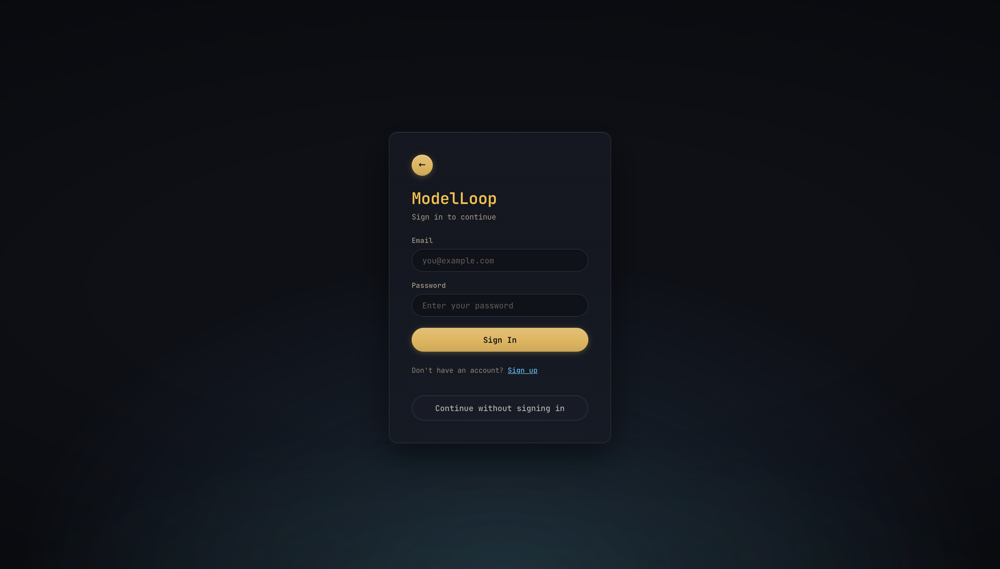
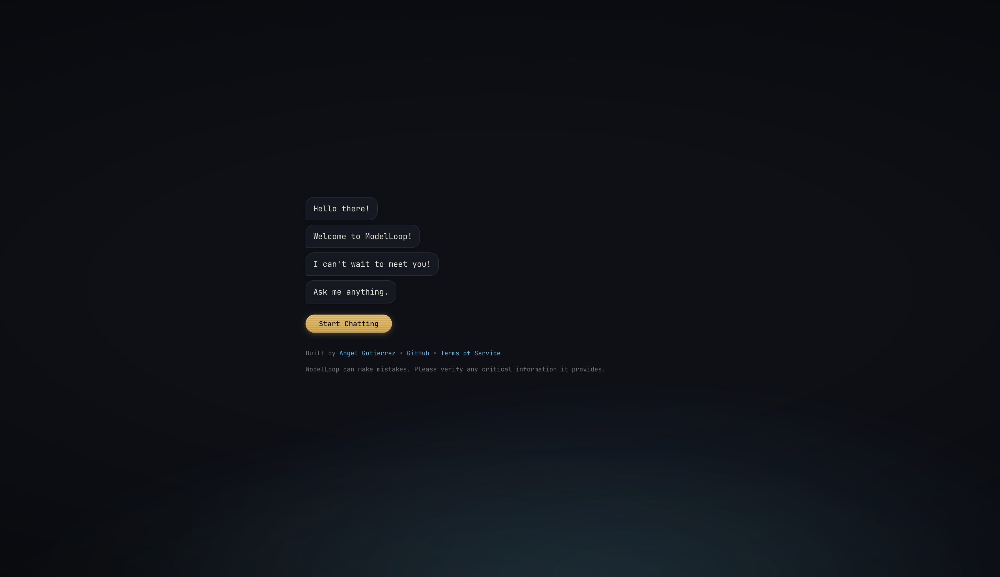
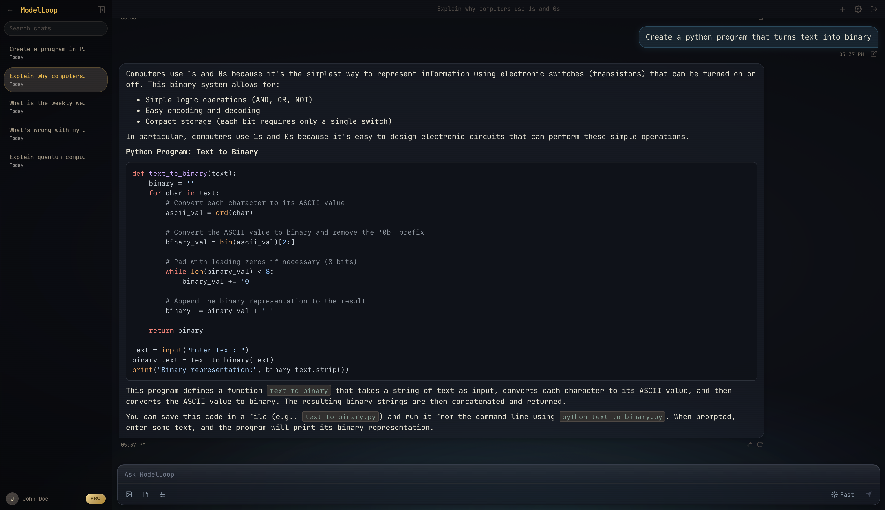
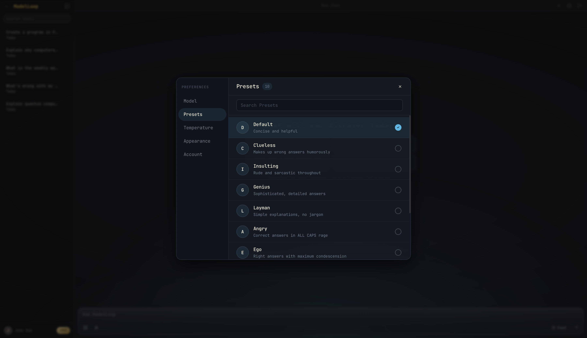
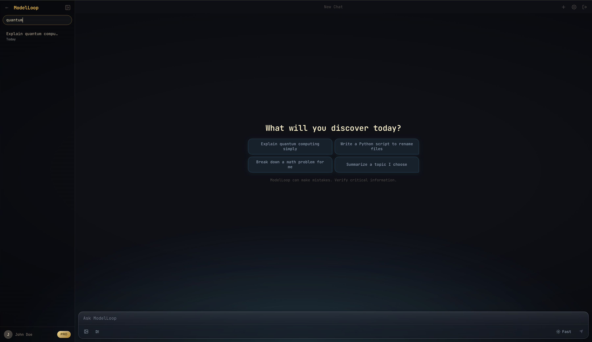

# ModelLoop

A self-hosted AI chat interface powered by Ollama.

## Project Structure

```
ModelLoop/
├── backend/                   # FastAPI server
│   ├── server.py              # Routes, SSE streaming, model cache
│   ├── auth.py                # JWT auth, bcrypt password hashing
│   ├── database.py            # Async SQLAlchemy engine + session
│   ├── models.py              # ORM models: User, Chat, Message
│   ├── requirements.txt
│   ├── tests/
│   │   ├── conftest.py
│   │   └── test_server.py
│   └── .env                   # JWT_SECRET, DATABASE_URL, OLLAMA_URL, ALLOWED_ORIGINS, APP_ENV
├── frontend/                  # React + TypeScript + Vite
│   ├── src/
│   │   ├── components/
│   │   │   ├── api.ts         # Centralized API client
│   │   │   ├── Chat.tsx       # Main chat UI + streaming
│   │   │   ├── ChatPreferences.tsx
│   │   │   ├── History.tsx    # Chat history modal
│   │   │   ├── LandingPage.tsx
│   │   │   └── Login.tsx      # Login + register form
│   │   ├── App.tsx            # Top-level view routing
│   │   ├── App.css            # All styles (Gruvbox dark theme)
│   │   ├── index.css          # Font import + body reset
│   │   └── main.tsx
│   ├── index.html
│   ├── package.json
│   └── .env                   # VITE_API_URL
├── screenshots/
└── README.md
```

## Current Features

- Chat with conversation context
- Multiple model support
- Session-based history (per-user conversations)
- Rate limiting protection
- Code syntax highlighting
- Markdown rendering
- Streaming responses (token-by-token)
- User support
- Keyboard shortcuts
- System prompt customization
- Chat History

## Getting Started

### Backend

```bash
cd backend
python -m venv .venv
source .venv/bin/activate
pip install -r requirements.txt
python server.py
```

### Frontend

```bash
cd frontend
npm install
npm run dev
```

## Features Coming Soon

- Themes + custom branding
- Hardware specs display
- Custom Ollama server URL configuration
- Regenerate response
- Edit & resubmit messages
- Export chat history (Markdown/JSON)
- Pull/delete models from UI
- Dark/light mode toggle
- Temperature/parameter controls
- Image support

## Screenshots






